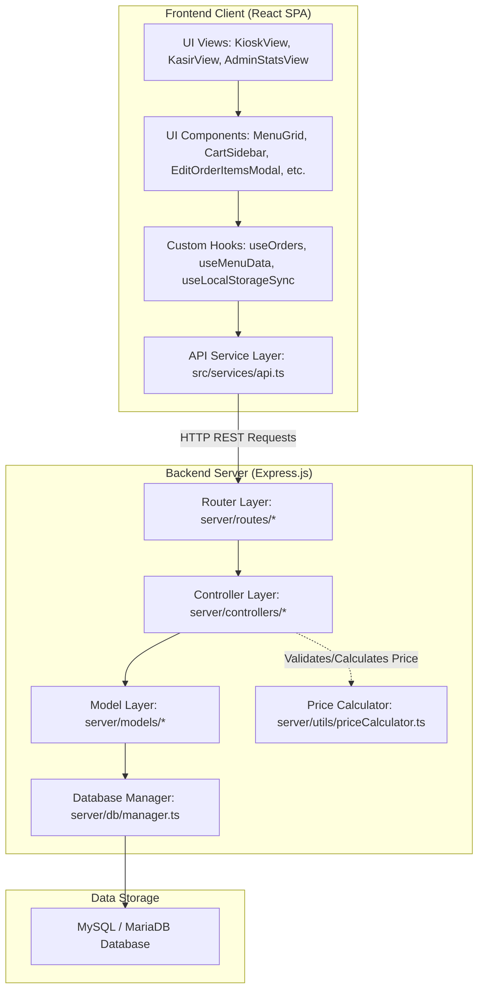
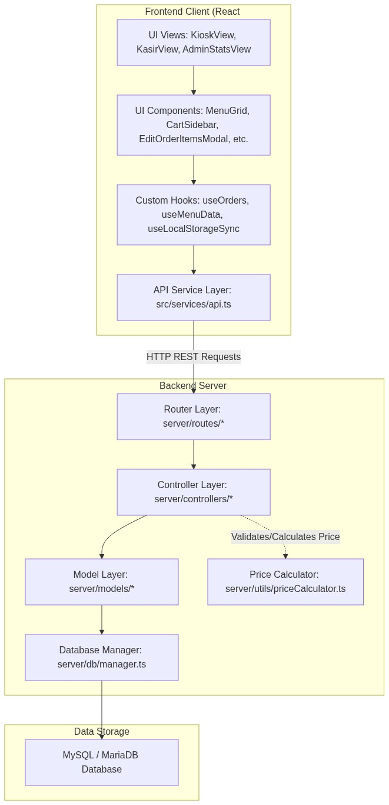
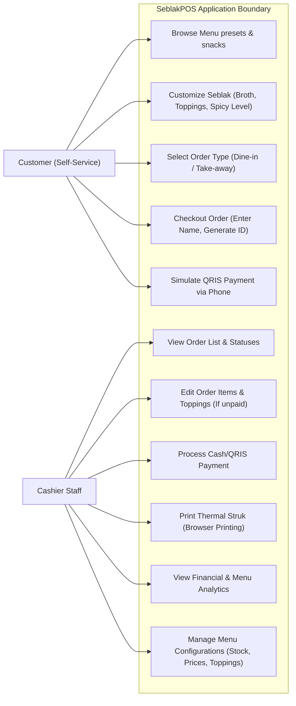
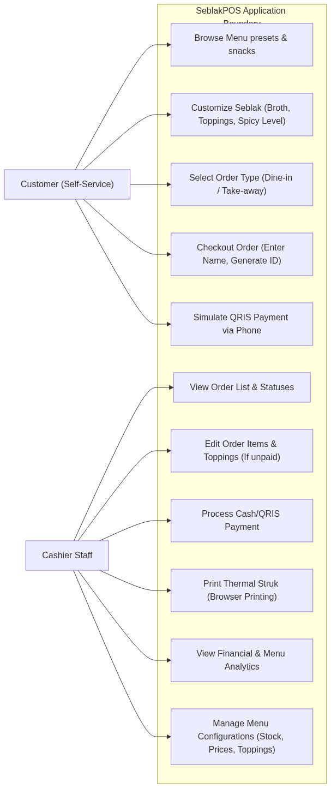
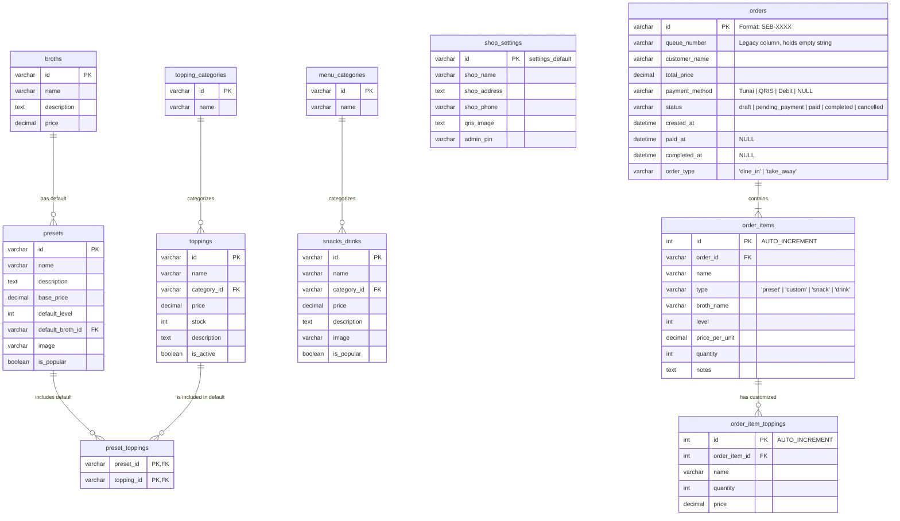
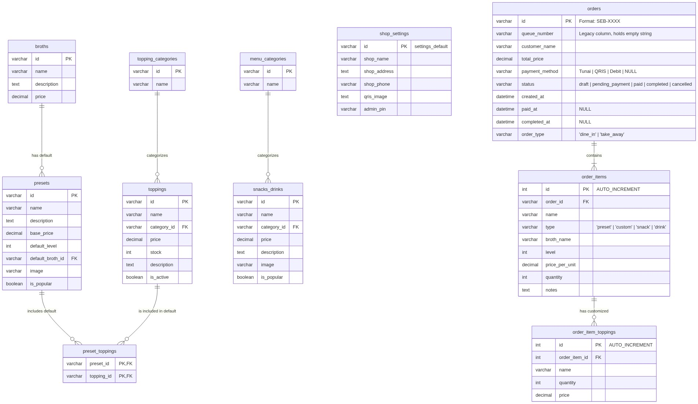
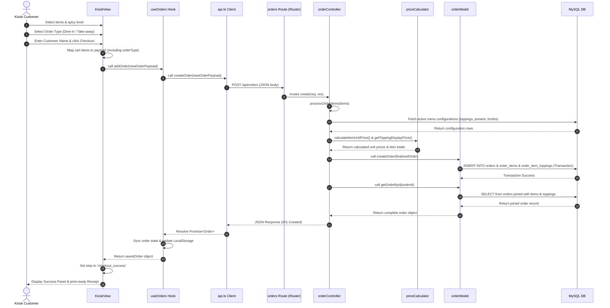
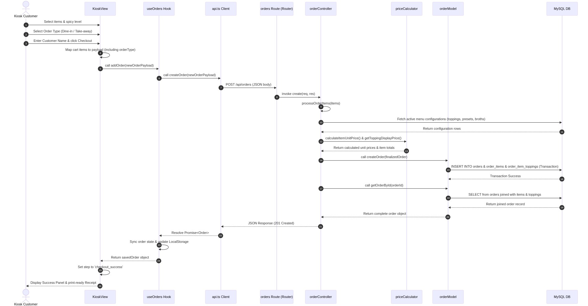
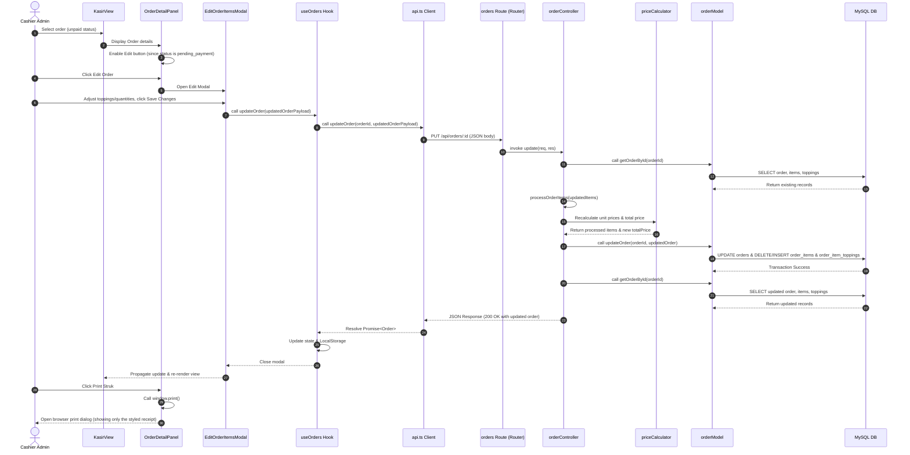
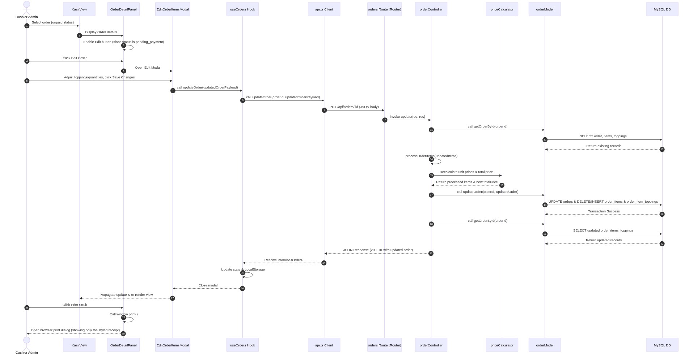

# SeblakPOS: Architectural Diagrams & Specifications

This document provides visual models of the SeblakPOS architecture, database relationships (ERD), use cases, and execution sequences.

---

## 1. System Component Diagram (MVC & Layered Architecture)

This diagram visualizes how the Frontend (React SPA) and Backend (Express.js) components are layered, and how they communicate with the database.

---

## 2. Use Case Diagram

The use cases model the interactions between Kiosk Customers, Cashier Staff, and the SeblakPOS system.

---

## 3. Entity Relationship Diagram (ERD)

The application uses MySQL/MariaDB as a relational data store. Orders are stored in a relational normalized format across three main transactional tables (`orders`, `order_items`, and `order_item_toppings`), while the menu categories, toppings, presets, snacks, and settings are managed in config tables.

---

## 4. Sequence Diagram: Kiosk Order Creation Flow

Shows the step-by-step transaction sequence when a customer places an order via the Self-Service Kiosk.

---

## 5. Sequence Diagram: Cashier Order Items Edit Flow & Print Flow

Shows the transaction sequence when the cashier edits order items/toppings, pays, or prints receipts.

