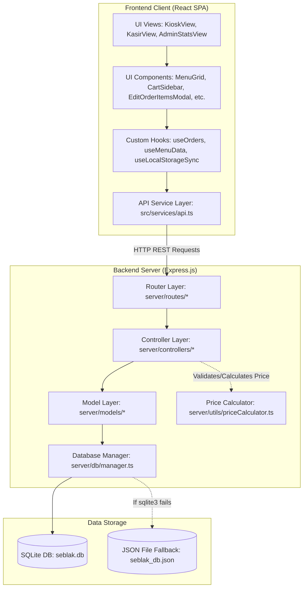
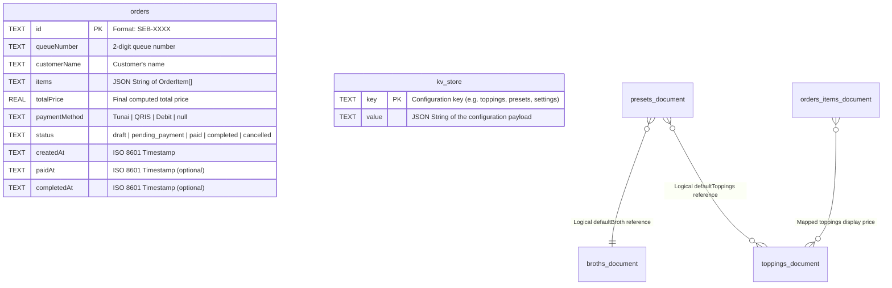
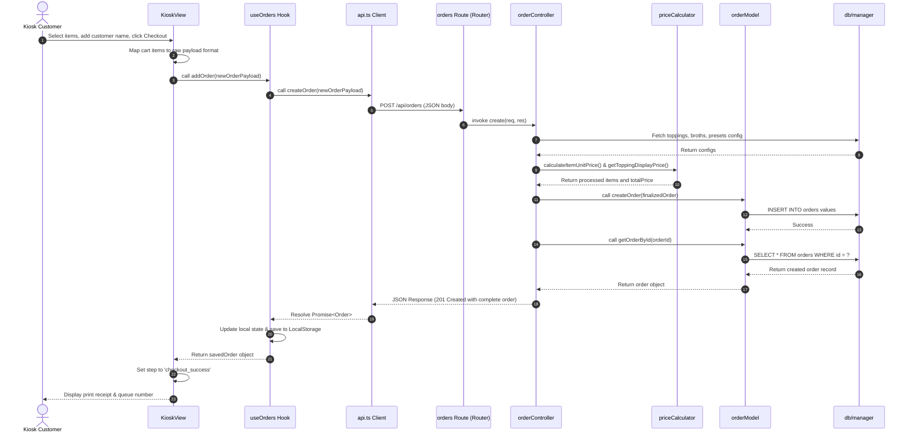
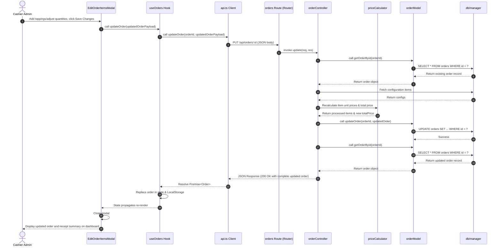

# SeblakPOS: Architectural Diagrams & Specifications

This document provides visual models of the SeblakPOS architecture, database relationships (ERD), and execution sequences.

---

## 1. System Component Diagram (MVC & Layered Architecture)

This diagram visualizes how the Frontend (React SPA) and Backend (Express.js) components are layered and how data flows between them.



---

## 2. Entity Relationship Diagram (ERD)

The application uses SQLite as a relational data store consisting of two main tables: `orders` (for transactions) and `kv_store` (acting as a document/setting registry store with JSON payloads).



### JSON Schema Structures inside Database Fields

#### A. Mapped Order `items` Column (inside `orders` table)
```json
[
  {
    "name": "Seblak Ndower Sosis Bakso",
    "type": "preset",
    "brothName": "Kuah Cikur Original (Juara)",
    "level": 4,
    "toppings": [
      { "name": "Kerupuk Kuning Sigung", "quantity": 1, "price": 0 },
      { "name": "Makaroni Spiral", "quantity": 1, "price": 0 },
      { "name": "Sosis Sapi Premium (4 pcs)", "quantity": 1, "price": 0 },
      { "name": "Bakso Sapi Slice (3 pcs)", "quantity": 1, "price": 0 },
      { "name": "Cuanki Tahu Spons (2 pcs)", "quantity": 1, "price": 0 },
      { "name": "Kol Segar Irisan", "quantity": 1, "price": 0 }
    ],
    "pricePerUnit": 17500,
    "quantity": 1,
    "notes": ""
  }
]
```

#### B. Mapped Configurations (inside `kv_store` value for key `'toppings'`)
```json
[
  {
    "id": "t_kerupuk_kuning",
    "name": "Kerupuk Kuning Sigung",
    "category": "karbo",
    "price": 1500,
    "stock": 50,
    "description": "Kerupuk seblak klasik, kenyal dan lembut"
  }
]
```

---

## 3. Sequence Diagram: Kiosk Order Creation Flow

Shows the step-by-step transaction sequence when a customer places an order via the Self-Service Kiosk.



---

## 4. Sequence Diagram: Cashier Order Items Edit Flow

Shows the transaction sequence when the cashier edits order items and toppings.


